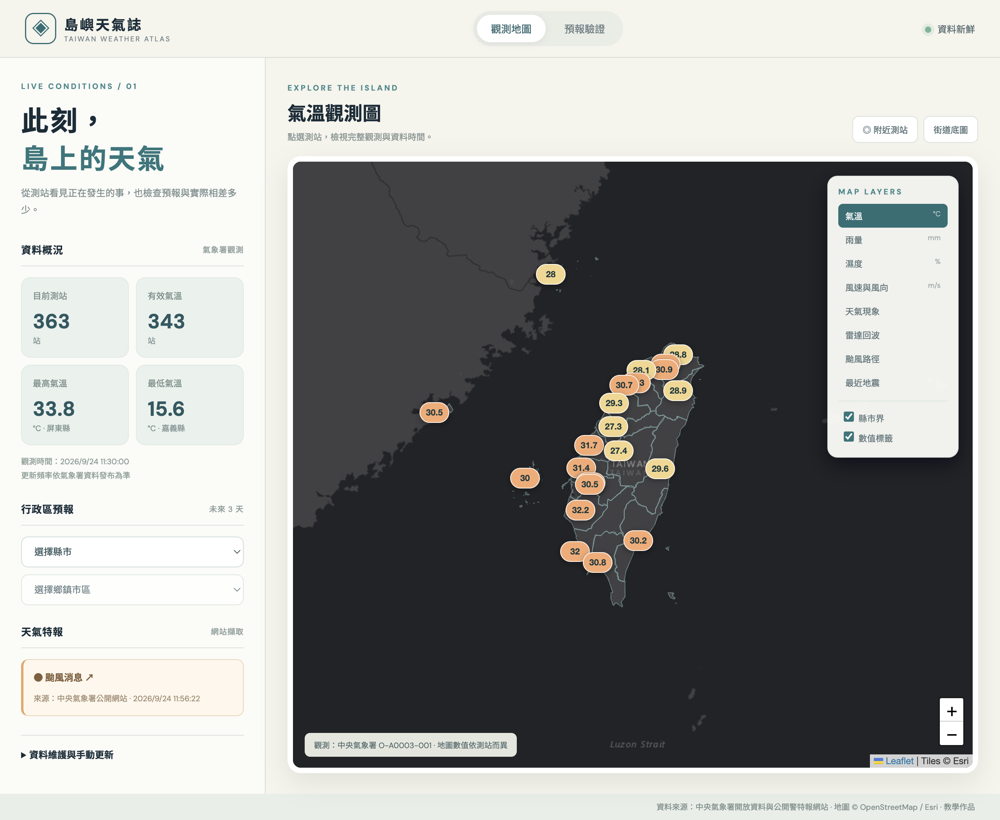

# 島嶼天氣誌｜臺灣智慧氣象與預報驗證

一個以臺灣氣象資料為核心的課程 MVP。React + Leaflet 顯示測站觀測、鄉鎮預報、網站警特報、地震與颱風；Flask 從中央氣象署取得資料，解析後保存於本機 SQLite 或線上的 Turso。預報驗證只比較溫度，並保留每次取得的預報版本。

## Demo

**線上展示：[島嶼天氣誌｜https://aiot-hw1.vercel.app/](https://aiot-hw1.vercel.app/)**

[](https://aiot-hw1.vercel.app/)

截圖日期：2026-09-24。點擊圖片即可開啟正式站；實際氣象資料與更新時間以網站顯示為準。

## 功能與特色

- 22 縣市、368 鄉鎮市區的三天預報；可查看溫度、體感溫度、濕度、降雨機率與天氣現象。
- 10 分鐘測站觀測地圖：氣溫、雨量、濕度、風速風向、天氣現象。縮小地圖時每縣市顯示代表觀測點，放大後顯示全部測站。
- 雷達透明影像、颱風路徑、最近顯著有感地震、縣市界與深色／街道底圖。
- 從中央氣象署公開網站擷取警特報清單；來源未同步時明確顯示未知狀態。
- 將鄉鎮預報與明確指定的代表測站配對，計算絕對誤差和 MAE。畫面顯示資料時間與缺值。
- 受密鑰保護的手動同步，以及 Vercel Hobby 每日排程範例。

此專案版面與視覺語言為自行設計。縣市界圖資取自 [g0v/twgeojson](https://github.com/g0v/twgeojson)，地圖使用 Leaflet；底圖分別來自 Esri 與 OpenStreetMap，須保留圖上來源標示。

## 技術與資料流

| 層次 | 技術 | 工作 |
| --- | --- | --- |
| 前端 | React、Vite、Leaflet | 地圖、圖層、鄉鎮選擇、預報驗證 |
| 後端 | Python、Flask | CWA API、網站擷取、解析、REST API |
| 資料庫 | SQLite（本機）、Turso（Vercel） | 保存測站、觀測、預報版本、警特報、地震、颱風 |

`中央氣象署 API／公開網站 → Flask → 解析與驗證 → SQLite/Turso → Flask REST API → React`

React 不呼叫需要授權碼的 CWA API，授權碼只存在伺服器環境變數。雷達 PNG 是官方公開靜態影像，地圖底圖是外部圖磚。

## 資料來源與時間粒度

| 用途 | 來源 | 使用方式 |
| --- | --- | --- |
| 地圖觀測 | `O-A0003-001` | CWA 開放資料 API，約 10 分鐘觀測 |
| 誤差分析觀測 | `O-A0001-001` | CWA 開放資料 API，逐時觀測 |
| 鄉鎮預報 | `F-D0047-001, 005, …, 085` | 22 個縣市資料集；近時段逐時，後續逐三小時 |
| 地震 | `E-A0015-001` | 顯著有感地震 |
| 颱風 | `W-C0034-005` | 活動熱帶氣旋分析與預報路徑 |
| 雷達 | `O-A0058-005` | [官方透明 PNG](https://opendata.cwa.gov.tw/dataset/observation/O-A0058-005)，影像範圍 115–126.5°E、17.75–29.25°N |
| 警特報 | [中央氣象署警特報網頁](https://www.cwa.gov.tw/V8/C/P/Warning/W26.html) | 擷取該網站載入的 `Warning_Content.js`，解析 `WarnAll` |

需求最初指定的 `F-D0047-093` [資料集頁](https://opendata.cwa.gov.tw/dataset/forecast/F-D0047-093)仍存在，但 2026-09-24 實際授權 REST 請求回傳 HTTP 404。上述 22 個縣市資料集逐一測試可用，且合計涵蓋 368 個鄉鎮市區。完整格式查核見 [docs/research/cwa-schema.md](docs/research/cwa-schema.md)，依據包括 [官方預報格式](https://opendata.cwa.gov.tw/opendatadoc/Forecast/F-D0047-001_093.pdf)及[觀測格式](https://opendata.cwa.gov.tw/opendatadoc/Observation/O-A0001-001.pdf)。

## 資料庫設計

`locations` 保存縣市、鄉鎮、地理代碼與座標；`stations` 保存測站資訊；`location_station_mapping` 保存手動核定的行政區代表站。第一版只核定「臺北市中正區 → 臺北站 466920」，其餘地區仍可看預報，但不顯示準確度分析。

`observations` 使用 `(station_id, observed_at, dataset_id)` 唯一鍵去重。`forecast_batches` 以來源 `records` 雜湊去除同一批重複下載，並保存 `issued_at` 與 `fetched_at`。`forecasts` 以 `(batch_id, location_id, kind, start_at, end_at)` 唯一鍵避免同版重複，但不同版本不覆蓋。`earthquakes`、`typhoon_points`、`warnings` 及 `source_status` 保存延伸圖層與同步狀態。資料庫主要欄位是正規化值，不是整包原始 JSON。

預報 REST 回傳沒有可信的發布時間，因此 `issued_at` 目前使用**取得時間代理**。相同內容重抓不產生新版本；來源內容有變化才建立新批次。這代表「取得時間」不是氣象署真正的發布時間。

## 預報與觀測的配對方法

1. 只用 `DataTime` 的單點溫度預報；`StartTime`／`EndTime` 的 12 小時平均溫度不能和某小時觀測直接比較。
2. 由 `location_station_mapping` 找行政區代表測站，不自動用遠處測站填空。
3. 對每個預報目標時間，選取 **目標時間之前取得的最後一版預報**；歷史版本仍留在資料庫。
4. 在該測站的 `O-A0001-001` 逐時觀測中，取最接近目標時間且時間差 **不超過 ±30 分鐘**、溫度有效的一筆；等距時取較早觀測。
5. `Absolute Error = |預報溫度 − 實測溫度|`；有效配對至少兩筆後，`MAE = 絕對誤差總和 ÷ 配對筆數`。

剛開始同步時，預報的目標時間還在未來，尚無可比較的實測；畫面會顯示「等待觀測」，不能以示範數字冒充真實 MAE。每日一次同步也只保存當次可取得的逐時觀測，因此 MAE 樣本累積較慢。

## 快速開始：本機 SQLite

需要 Python 3.10 以上、Node.js 與 npm。SQLite 隨 Python 內建，**不需要另行架設 PostgreSQL**。

```bash
python3 -m venv .venv
source .venv/bin/activate
pip install -r requirements.txt
cp .env.example .env
```

到[中央氣象署氣象資料開放平台](https://opendata.cwa.gov.tw/)註冊並在帳戶頁取得 Authorization Key，填入 `.env` 的 `CWA_API_KEY`。自行產生 `REFRESH_TOKEN`（例如 `python3 -c 'import secrets; print(secrets.token_urlsafe(32))'`），填入同一檔案。`.env` 已被 `.gitignore` 排除。

初次取得資料並建立 SQLite 表格：

```bash
set -a; source .env; set +a
PYTHONPATH=backend python -m weather.sync --all
```

只更新臺北市預報的範例：

```bash
PYTHONPATH=backend python -m weather.sync --dataset F-D0047-061
```

後端：

```bash
python -m flask --app app run --port 5000
```

另一個終端啟動前端：

```bash
cd frontend
npm ci
npm run dev
```

開啟 `http://localhost:5173`。Vite 開發伺服器會把 `/api` 轉送到本機 Flask。前端正式建置可執行 `cd frontend && npm run build`。

## 環境變數

| 名稱 | 用途 |
| --- | --- |
| `CWA_API_KEY` | 伺服器呼叫中央氣象署 API 的 Authorization Key，必要 |
| `REFRESH_TOKEN` | 前端「資料維護」手動更新時輸入的維護者密鑰；不寫進前端程式碼 |
| `CRON_SECRET` | Vercel 排程 GET 同步所用的 Bearer 密鑰；Vercel 會自動附帶 |
| `SQLITE_PATH` | 本機 SQLite 檔案路徑；預設 `backend/weather.sqlite3` |
| `TURSO_DATABASE_URL` | 線上 Turso 資料庫 URL；Vercel 環境必要 |
| `TURSO_AUTH_TOKEN` | 線上 Turso 認證令牌；Vercel 環境必要 |

`GET /api/refresh` 只接受正確的 `Authorization: Bearer <CRON_SECRET>`；`POST /api/refresh` 只接受正確的 `X-Refresh-Token`。缺少或錯誤密鑰回傳 403，成功同步後同一資料來源五分鐘內再更新回傳 429。密鑰不要放進 Git、網址或截圖。

## REST API

| 方法與路徑 | 回傳 |
| --- | --- |
| `GET /api/health` | 服務健康狀態 |
| `GET /api/stations` | 10 分鐘觀測測站；可加 `?dataset=O-A0001-001` |
| `GET /api/locations` | 行政區與代表站 |
| `GET /api/forecast?location_id=…` | 最新批次的未來預報 |
| `GET /api/analysis?location_id=…` | 有效配對、絕對誤差、樣本數、MAE |
| `GET /api/warnings` | 網站擷取的特報清單與來源狀態 |
| `GET /api/earthquakes` | 最近地震 |
| `GET /api/typhoons` | 颱風分析／預報路徑點 |
| `POST /api/refresh?dataset=…` | 受密鑰保護的手動同步 |

## Vercel 與 Turso

Vercel 函式的本機 SQLite 檔案不具持久性，因此正式環境必須設定 `TURSO_DATABASE_URL`、`TURSO_AUTH_TOKEN`；程式在 `VERCEL` 環境沒有 Turso URL 時會拒絕使用臨時 SQLite。[Vercel Flask 文件](https://vercel.com/docs/frameworks/backend/flask)說明 Flask `app.py` 入口與 `public/` 靜態檔案；[Vercel SQLite 說明](https://vercel.com/kb/guide/is-sqlite-supported-in-vercel)說明其持久化限制。

1. 建立 Turso 資料庫及認證令牌，將上述兩個值加到 Vercel 專案 Production 私密環境變數。另設定 `CWA_API_KEY`、`REFRESH_TOKEN`、`CRON_SECRET`。
2. 以 `vercel --prod` 部署。根目錄的 `vercel.json` 會建置 React 並放入 `public/`；`api/index.py` 將 `/api/*` 交給 Flask。`app.py` 是本機 Flask 入口。
3. 第一次上線後以維護者密鑰手動同步，或在連接 Turso 的本機環境執行上述 `weather.sync --all` 初始化全臺。
4. Vercel Hobby 的 Cron 每項工作每天最多執行一次；本專案範例每日更新觀測、22 縣市預報、地震、颱風與特報，預報工作分散於不同小時。實際時間以網站顯示的觀測時間為準，不能把每日同步說成每 10 分鐘即時更新。[Vercel Cron 限制](https://vercel.com/docs/cron-jobs/usage-and-pricing)。

**正式站：**[aiot-hw1.vercel.app](https://aiot-hw1.vercel.app/)；程式碼：[superMLK/AIoT-HW1](https://github.com/superMLK/AIoT-HW1)。2026-09-24 已使用 Turso 初始化 368 個行政區的資料，並驗證正式站首頁、測站、鄉鎮預報、警特報、地震、颱風及分析 API。程式碼已推送 GitHub，但 Vercel 帳戶尚未建立 GitHub Login Connection，**推送不會自動觸發部署**；目前由維護者執行 `vercel --prod` 上版。

## 測試與目前限制

```bash
PYTHONPATH=backend python -m unittest discover -s backend/tests -v
cd frontend && npm run build
```

- 警特報爬蟲目前從官方網站載入的 JS 取得「有哪些特報」，尚未解析警報內文、影響地區與結束時間；不能把它當完整 CAP 警報。
- 雷達圖層取官方透明 PNG，尚未解析其影像時間；不能保證影像一定新鮮。PNG 與底圖的投影不同，圖像位置可能有偏差。
- 縣市界使用 g0v 2010 年圖資並經簡化，適合示意，不適合精確行政界查詢。
- 地圖小比例尺只顯示各縣市一個觀測點，不代表縣市平均值；放大後才顯示全部站點。
- 目前只有臺北市中正區核定代表測站。無代表站的地區不會顯示誤差分析。
- 一日一次排程無法提供高頻歷史觀測；若需要更密集的 MAE 樣本，須調整同步策略或方案。

後續可補警報影響地區、可靠的雷達時間與投影、更多人工核定的代表測站，以及更密集且受控的資料同步；不把機器學習、帳號系統或推播納入本版。
